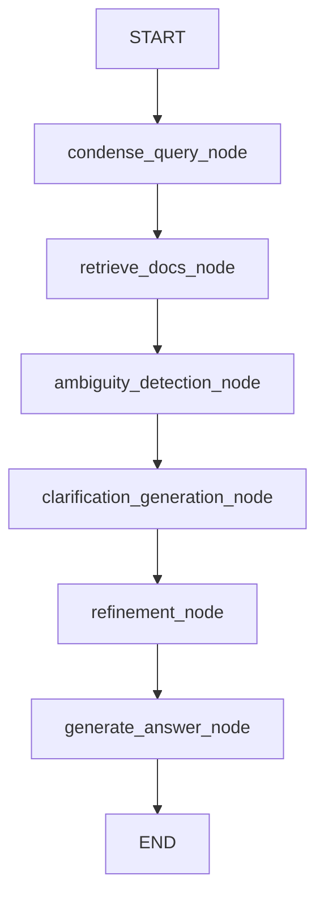

# Backend Documentation - Minimal Banking RAG (Beginner-Friendly Edition)

Welcome to the DocuMind Portal backend API server codebase! This document is written for junior developers, interns, and future maintainers. It explains how the backend handles document processing, database storage, user security, and RAG agent execution.

---

## 💡 Jargon Buster (Key Terms Explained)

If you are new to some of these terms, here is what they mean in this project:

*   **API (Application Programming Interface):** A set of rules and endpoints that allow the frontend (client) to talk to the backend (server).
*   **FastAPI:** A modern, high-speed Python framework used to create these endpoints easily.
*   **Uvicorn:** A lightning-fast web server that hosts and runs the Python FastAPI application.
*   **RAG (Retrieval-Augmented Generation):** The core process of this app. When a user asks a question, the server searches for matching documents in its database (Retrieval), updates the request with this context (Augmented), and passes it to the AI model to write a response (Generation).
*   **Vector Database (ChromaDB):** A database that saves documents as coordinates (vectors) indicating their semantic "meaning." It allows finding related texts based on context, even if they don't share any exact words.
*   **Lexical Search (BM25):** A keyword search algorithm. It works like Ctrl+F but ranks results based on how often search terms appear in each document.
*   **RRF (Reciprocal Rank Fusion):** An algorithm that merges the vector search list and the keyword search list into one master list, ranking the most relevant pages first.
*   **LangGraph:** A framework used to build complex, step-by-step AI workflows. It organizes the AI logic as a "graph" where each node is a Python function that performs a single task (like finding ambiguities or generating questions).
*   **Pydantic:** A Python tool that checks JSON data sent to the API. It makes sure that if the API expects a string, it actually receives a string, returning an error automatically if the data format is wrong.
*   **Bcrypt:** A security tool that hashes passwords (scrambles them into an unreadable string) before saving them in the database.
*   **SQLite3:** A simple SQL relational database that stores data in a single local file (here, `users.db`). We use it to save registered users.

---

## 1. Project Overview

The backend is the core intelligence engine of the DocuMind Portal. It handles:
1.  **Ingestion:** Parsing uploaded PDFs, CSV files, raw text, or requirements JSONs, splitting them into readable chunks, and indexing them.
2.  **Hybrid Retrieval:** Finding related document matches using both semantic similarity and exact keyword searches.
3.  **Agent Orchestration:** Executing a stateful LangGraph agent that refines queries, retrieves context, highlights ambiguities, designs clarification questions, and compiles requirement summaries.
4.  **Local vs. Cloud Execution:** Running prompts on a local model (DeepSeek-R1 via Ollama) to support strict document privacy, or forwarding prompts to a cloud model (DeepSeek-V3 via Azure API gateway).

---

## 2. Tech Stack

Here is a list of the core backend technologies:

| Technology | Version | Purpose |
| ---------- | ------- | ------- |
| **FastAPI** | Latest | The web framework used to define REST API routes. |
| **Uvicorn** | Latest | The ASGI application server used to run the FastAPI app. |
| **LangGraph** | Latest | Manages the multi-step Business Analyst agent state. |
| **ChromaDB** | Latest | Local vector store database for semantic document searching. |
| **rank-bm25** | Latest | Runs fast keyword-matching index queries. |
| **langchain-openai** | Latest | Connects to the cloud AI models hosted on the TCS GenAI Lab Azure gateway. |
| **langchain-ollama** | Latest | Connects to local AI models running on the user's machine. |
| **pypdf** | Latest | Extracts raw text from uploaded PDF files. |
| **SQLite3** | Native | Relational database used to store user credential records. |
| **python-jose** | Latest | Encrypts and decrypts JWT login credentials tokens. |
| **passlib[bcrypt]** | Latest | Scrambles and validates passwords securely. |

### Important Packages: Why and How We Use Them

#### 💡 FastAPI
*   **Why:** It is async-first, extremely fast, and automatically creates API interactive test pages (accessible at `/docs`).
*   **Where:** In `main.py` and `auth/routes.py`.
*   **How:** We declare route paths (e.g. `@app.post("/api/chat/query")`) and use Pydantic models to validate the incoming JSON request bodies.

#### 💡 LangGraph
*   **Why:** RAG applications often require multiple sequential steps (condense query -> search database -> extract findings -> construct response). LangGraph structures these steps cleanly.
*   **Where:** Inside `services.py` -> Compiled as the `graph` object.
*   **How:** It passes an `AgentState` dictionary from one Python function (node) to the next, logging the history using `MemorySaver` so the AI remembers previous statements in the chat.

#### 💡 ChromaDB & rank-bm25
*   **Why:** Vector searches can sometimes miss exact matches (like serial codes or custom names), and keyword searches can miss synonyms. Combining them via hybrid search solves both issues.
*   **Where:** Used inside the retrieval phase of `services.py`.
*   **How:** ChromaDB runs a vector mathematical query. BM25 runs a word count query. We then combine their ranks using a Reciprocal Rank Fusion (RRF) calculation.

---

## 3. Project Structure

Here is a map of the backend directories and files:

```
backend/
├── auth/                       # Security and Auth folder
│   ├── dependencies.py         # Injects get_current_user logic to protect API routes
│   ├── routes.py               # Holds signup (/register) and login (/login) routes
│   └── security.py             # Bcrypt hashing and JWT token generating scripts
├── chroma_db/                  # Local folder containing the persisted vector database files
├── config.py                   # Central settings, databases configurations, and AI initializations
├── main.py                     # Entry point defining the FastAPI application and main routers
├── schemas.py                  # Pydantic schemas validating input JSON shapes
├── services.py                 # Key services (Ingestion, Hybrid Search, and LangGraph flow)
├── data.json                   # Static JSON file preloaded with requirements templates
├── verify.py                   # Integration script to test the complete ingest-and-query loop
├── test_all_endpoints.py       # Integration tests file executing all API routes
└── users.db                    # SQLite3 database storing register account records
```

### Folder Responsibilities

*   **`auth/`:** Security gatekeeper. It decodes JWT header tokens. If the token is invalid, it stops the request and returns a `401 Unauthorized` response to the client.
*   **`config.py`:** Initiates SQLite database connections, configures global HTTP clients, and starts connections to the OpenAI Azure gateway or local Ollama DeepSeek instance.

---

## 4. API Endpoints Reference

Here is a detail of the routes exposed by the API server:

### 1. Health Status (`GET /health`)
*   **Auth Required:** No
*   **Purpose:** Simple check to verify the backend server is running.
*   **Response:** `{ "status": "ok" }`

### 2. User Registration (`POST /auth/register`)
*   **Auth Required:** No
*   **Request URL Query Params:** `email` and `password`
*   **Response:** `{ "message": "User created", "user_id": "1" }`

### 3. User Login (`POST /auth/login`)
*   **Auth Required:** No
*   **Request Body:** Sent as form parameters (`username` (user email) and `password`).
*   **Response:** `{ "access_token": "eyJhbG...", "token_type": "bearer" }`

### 4. PDF Ingestion (`POST /api/ingest/pdf`)
*   **Auth Required:** Yes
*   **Request Body:** Multipart file upload.
*   **Response:** `{ "status": "success", "chunks": 23 }`

### 5. CSV Ingestion (`POST /api/ingest/csv`)
*   **Auth Required:** Yes
*   **Request Body:** Multipart file upload.
*   **Response:** `{ "status": "success", "rows": 50 }`

### 6. Text Ingestion (`POST /api/ingest/text`)
*   **Auth Required:** Yes
*   **Request Body (JSON):** `{ "text": "..." }`
*   **Response:** `{ "status": "success", "chunks": 4 }`

### 7. Chatbot Query (`POST /api/chat/query`)
*   **Auth Required:** Yes
*   **Request Body (JSON):**
    ```json
    {
      "question": "Need a secure payment gateway",
      "domain": "Ecommerce",
      "session_id": "session_123",
      "privacy_mode": false
    }
    ```
*   **Response:** Returns a compiled RAG assistant message containing:
    *   `answer`: The AI markdown response string.
    *   `sources`: Citations of matching indexed requirements.
    *   `ambiguities`: JSON array of identified ambiguities.
    *   `clarification_questions`: Questions generated for the user.
    *   `refined_requirement`: Compilation of the finalized requirement.

---

## 5. Relational & Vector Databases

The backend implements two types of databases:

### 1. SQLite Relational DB (`users.db`)
Stores user login details.
*   **Table:** `users`
*   **Fields:**
    *   `id`: Primary key (Integer, increments automatically).
    *   `email`: User email string (Unique, cannot have duplicates).
    *   `password`: Hashed password string (Scrambled via Bcrypt).

### 2. ChromaDB Vector Store (`chroma_db/`)
Stores the text chunks extracted from uploaded documents.
*   **Collection Name:** `"documents"`
*   **Metadata Fields attached to each chunk:**
    *   `user_id`: Enforces data privacy. Users can only query files they uploaded.
    *   `source`: File name where the chunk was extracted.
    *   `type`: Type of file (`"pdf"`, `"csv"`, `"text"`, `"requirement"`).

---

## 6. Authentication & Security Flow

Here is how security works:

1.  **Register:** A user submits their email and password. The system salts and hashes the password using Bcrypt:
    ```python
    hashed_password = hash_password(password) # returns a scrambled string
    ```
    This is saved in SQLite database.
2.  **Log In:** The user submits their credentials. The system verifies the password using the saved hash:
    ```python
    verify_password(plain_password, hashed_password) # returns True or False
    ```
3.  **Token Issuance:** If valid, the system signs a JWT access token containing a `sub` claim (subject) set to the user's ID:
    ```python
    token = jwt.encode({ "sub": str(user_id), "exp": expiration_time }, JWT_SECRET, algorithm="HS256")
    ```
4.  **Route Protection:** Protected routes inject the `get_current_user` dependency. It decodes the token header. If the signature is correct, it returns the `user_id` to allow data query operations.

---

## 7. Business Logic & LangGraph RAG Agent

### Hybrid Search In-depth
The search pipeline uses a custom **RRF (Reciprocal Rank Fusion)** calculation to merge dense vector queries and sparse keyword queries:
1.  **Chroma search:** Fetches the top 4 semantic matches.
2.  **BM25 search:** Fetches the top 4 exact keyword matches.
3.  **RRF merge:** For each document, we calculate a score:
    $$\text{Score} = \sum \frac{\text{Weight}}{60 + \text{Rank}}$$
    *   Semantic Weight = $0.6$
    *   Keyword Weight = $0.4$
    *   **Distance Penalty:** If a vector match's distance is high ($>1.2$, meaning the meaning is barely related), the system automatically reduces its weight to $0.15$ to prioritize exact keyword matches.
4.  Returns the top 6 combined document matches.

### The LangGraph Agent Flow

When the user queries the chatbot, the workflow runs through the following 6 nodes in order:



1.  **`condense` (Query Condensation):** Rewrites follow-up messages into standalone questions. For example: *"What about shipping?"* becomes *"What are the shipping methods for the order tracking system?"*.
2.  **`retrieve` (Document Retrieval):** Invokes `hybrid_search()` to search the database.
3.  **`ambiguity_detection` (Ambiguity Analysis):** The AI scans the requirement text and outputs a list of ambiguities (e.g. missing SLA, undefined refund rules).
4.  **`clarification_generation` (Question Generation):** The AI generates multiple clarification questions to ask the user.
5.  **`refinement` (Requirement Compiling):** Compiles a structured summary of the refined requirement.
6.  **`generate` (Response Generation):** Returns the structured markdown result (Ambiguities + Clarifications + Summary) to the user.

---

## 8. Environment Variables

Create a file named `.env` in the server root folder:

```env
OPENAI_API_KEY=your_tcs_azure_api_key
JWT_SECRET=your_custom_secret_signature_key
```

> [!WARNING]
> Never commit the `.env` file to git repositories. It contains sensitive passwords and API keys.

---

## 9. Setup & How to Run

Follow these steps to run the backend API server on your local machine:

1.  **Open your terminal** and navigate to the backend directory:
    ```bash
    cd Hackathon-Server
    ```
2.  **Create and activate a virtual environment** (this isolates backend python libraries):
    ```bash
    python -m venv venv
    source venv/bin/activate
    ```
3.  **Install dependencies:**
    ```bash
    pip install -r requirements.txt
    ```
4.  **Start the API server:**
    ```bash
    uvicorn main:app --reload --port 8000
    ```
    *   The server will start at `http://127.0.0.1:8000`. You can inspect the interactive documentation page at `http://127.0.0.1:8000/docs`.
5.  **Run pipeline tests and preload requirement templates:**
    ```bash
    python verify.py
    ```

---

## 10. Adding New Features (Step-by-Step)

### 1. How to Add a New API Endpoint
1.  Open `main.py`.
2.  Define a new endpoint with a decorator:
    ```python
    @app.delete("/api/documents/delete/{source_name}")
    async def delete_doc(source_name: str, user_id: str = Depends(get_current_user)):
        # 1. Access ChromaDB connection
        # 2. Delete entries matching user_id and source name
        # 3. Return a success message
        return { "status": "success", "message": f"Deleted {source_name}" }
    ```

### 2. How to Add a New Ingestion Parser
1.  Open `services.py`.
2.  Add a new parsing function:
    ```python
    async def process_xml(file, user_id):
        content = await file.read()
        # Parse XML text here...
        # Split text into documents using RecursiveCharacterTextSplitter
        # Add to Chroma: get_db().add_documents(docs)
        return len(docs)
    ```
3.  Import and add the endpoint handler in `main.py`.
