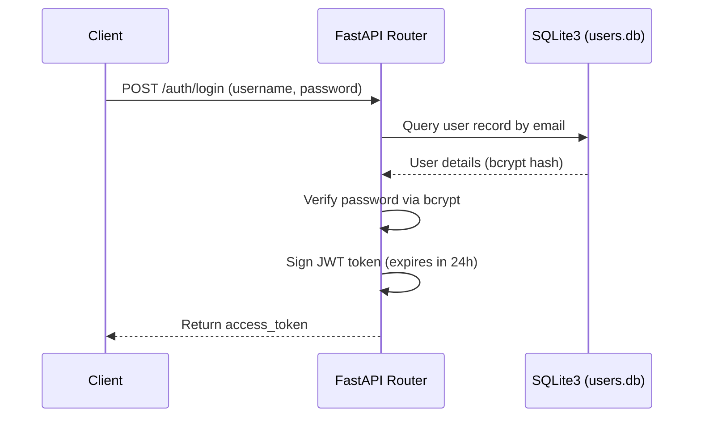
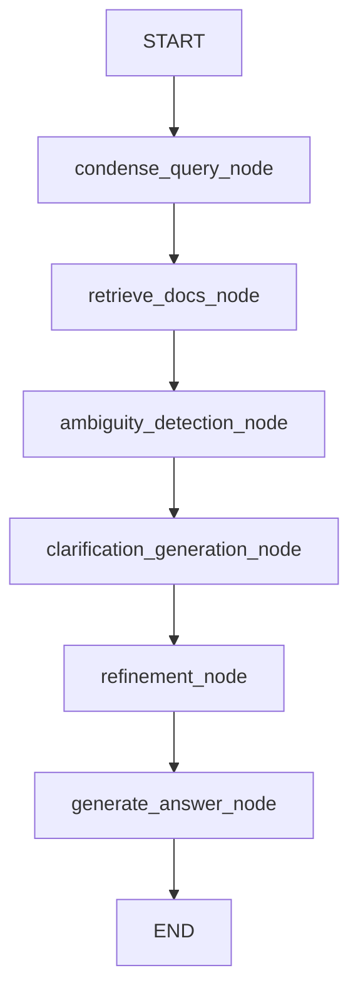

# Backend Documentation - Minimal Banking RAG

This document serves as the guide for the backend API server of the Requirements Ambiguity Analyzer. This guide covers the technology stack, application architecture, DB models, API endpoints, LangGraph orchestrator, and instructions for running and extending the server-side system.

---

## 1. Project Overview

The backend serves as the RAG processing and orchestration engine for requirements engineering. It ingests requirements documents, generates semantic and lexical indices, and runs a stateful conversational analysis agent.

### Main Responsibilities
* **Multi-Format Document Parsing:** Handles text extraction from PDFs, CSV rows, raw text payloads, and structured requirement JSONs.
* **Hybrid Lexical & Semantic Retrieval:** Combines vector similarity searches (dense retrieval) and keyword searches (sparse BM25 retrieval) using Reciprocal Rank Fusion (RRF).
* **Stateful Agentic Workflow:** Orchestrates a 6-node LangGraph agent to handle query refinement, template retrieval, ambiguity detection, clarification question generation, and summary compilation.
* **Dual Execution Environments:** Toggles dynamically between Cloud APIs (Azure OpenAI base URL forwarding TCS GenAI Lab models) and Local engines (local Ollama deepseek-r1) based on user privacy choices.
* **Authentication and Security:** Encrypts user credentials in a local SQLite relational store and secures API endpoints using OAuth2 JWT bearer tokens.

---

## 2. Tech Stack

| Technology | Version | Purpose |
| ---------- | ------- | ------- |
| **FastAPI** | Latest | High-performance async web framework for API routes |
| **Uvicorn** | Latest | Lightweight ASGI server runner |
| **LangGraph** | Latest | Multi-agent state orchestration framework |
| **ChromaDB** | Latest | Embedded vector store database for semantic indexing |
| **rank-bm25** | Latest | Lexical keyword indexer matching exact search terms |
| **langchain-openai** | Latest | Integration package for OpenAI-compatible TCS Azure API gateways |
| **langchain-ollama** | Latest | SDK wrapper for running local DeepSeek-R1 instances |
| **pypdf** | Latest | Raw PDF text extraction and document loader |
| **SQLite3** | Native | Relational database engine for account persistence |
| **python-jose** | Latest | Signed JWT access token operations |
| **passlib[bcrypt]** | Latest | Bcrypt password salting and verification context |

### Important Packages Explanation

#### 1. FastAPI
* **Why it is used:** Allows building fast, asynchronous endpoints with automated OpenAPI (Swagger) documentation.
* **Where it is used:** Declared in `main.py` and modularized routers under `auth/routes.py`.
* **How it works in this project:** Declares decorators (e.g. `@app.post()`), injects OAuth2 token parsers via `Depends(get_current_user)`, and accepts binary multipart files (`UploadFile`).

#### 2. LangGraph
* **Why it is used:** Orchestrates complex, multi-stage LLM reasoning chains as a stateful graph.
* **Where it is used:** Core business logic compiler inside `services.py`.
* **How it works in this project:** Defines a state dictionary (`AgentState`) tracking inputs/outputs, compiles six sequential nodes, and runs the chain with a local checkpointer (`MemorySaver`) to preserve session state.

#### 3. ChromaDB & rank-bm25
* **Why it is used:** Drives the Hybrid Search engine. Chroma handles semantic similarity, while BM25 handles keyword-level lookups.
* **Where it is used:** Embedded database under `chroma_db/` folder; functions defined in `services.py` -> `hybrid_search()`.
* **How it works in this project:** When a document is ingested, it is added to Chroma. During searches, the system queries Chroma (dense) and BM25 (sparse), combining results via Reciprocal Rank Fusion (RRF).

#### 4. Python-Jose & Passlib
* **Why it is used:** Secures application routes and implements JWT auth.
* **Where it is used:** `auth/security.py` and dependency injection in `auth/dependencies.py`.
* **How it works in this project:** Passlib encrypts passwords before saving to SQLite. Python-Jose issues a signed JWT (`HS256`) that is sent back to the client.

---

## 3. Project Structure

```
backend/
├── auth/                       # Authentication and authorization module
│   ├── __init__.py
│   ├── dependencies.py         # Bearer token validation and dependency injector
│   ├── routes.py               # Authentication endpoints (register/login)
│   └── security.py             # Bcrypt hashing and JWT signature functions
├── chroma_db/                  # Local directory persisting Chroma vector databases
├── main.py                     # Entry point declaring FastAPI app, CORS rules, and routers
├── config.py                   # Central settings, SQLite connections, and LLM instances
├── schemas.py                  # Pydantic schemas validating client request payloads
├── services.py                 # Ingestion parsing, hybrid search, and LangGraph workflow
├── data.json                   # Sample structured eCommerce requirements database
├── verify.py                   # Integration script testing main RAG workflow
├── test_all_endpoints.py       # Comprehensive API endpoint verification script
└── users.db                    # SQLite3 relational user account database file
```

### Folder Responsibilities

* **`auth/`**: Standardizes password hashing, credential checks, JWT signature verification, and FastAPI dependency checks.
* **`chroma_db/`**: Holds SQLite and parity log binaries representing dense document vectors.
* **`config.py`**: Exports client connections for embeddings (Azure-based), local model wrappers (Ollama), cloud model wrappers (Azure ChatOpenAI), and SQLite databases.
* **`services.py`**: The core business logic file. Houses document parsers, the RRF search engine, and the LangGraph orchestrator.

---

## 4. API Endpoints

| Method | Endpoint | Description | Auth Required |
| ------ | -------- | ----------- | ------------- |
| **GET** | `/health` | API server status check | No |
| **POST** | `/auth/register` | Registers a new account | No |
| **POST** | `/auth/login` | Logins in user, returns access token | No |
| **POST** | `/api/ingest/pdf` | Ingests a PDF document | Yes |
| **POST** | `/api/ingest/csv` | Ingests a CSV requirements sheet | Yes |
| **POST** | `/api/ingest/text` | Ingests a raw text block | Yes |
| **POST** | `/api/ingest/json` | Ingests a requirement template JSON file | Yes |
| **POST** | `/api/chat/query` | Submits message to the RAG LangGraph agent | Yes |

### Endpoint Details

#### 1. Registration (`POST /auth/register`)
* **Request Params:** `email` (string), `password` (string)
* **Response Payload:**
  ```json
  {
    "message": "User created",
    "user_id": "1"
  }
  ```

#### 2. Authentication Login (`POST /auth/login`)
* **Request Body:** Form parameters containing `username` and `password`.
* **Response Payload:**
  ```json
  {
    "access_token": "eyJhbG...",
    "token_type": "bearer"
  }
  ```

#### 3. Document Ingestion (`POST /api/ingest/pdf` or `/api/ingest/csv` or `/api/ingest/json`)
* **Request Body:** Multipart `file` object.
* **Response Payload:**
  ```json
  {
    "status": "success",
    "chunks": 12 // or "rows"
  }
  ```

#### 4. Chat Query (`POST /api/chat/query`)
* **Request Body:**
  ```json
  {
    "question": "Need credit card validation handling Stripe.",
    "domain": "Ecommerce",
    "session_id": "verify_session",
    "privacy_mode": false
  }
  ```
* **Response Payload:**
  ```json
  {
    "answer": "Professional RAG analyst response detailing ambiguities...",
    "sources": [
      {
        "domain": "Ecommerce",
        "subdomain": "Payment Gateway",
        "requirement_id": "2",
        "user_id": "1",
        "type": "requirement"
      }
    ],
    "ambiguities": [
      "Refund handling limits are not defined."
    ],
    "clarification_questions": [
      "Should we automate validation?"
    ],
    "refined_requirement": "Compile structured requirement scope summary..."
  }
  ```

---

## 5. Database Architecture

The backend implements a two-tier database architecture to decouple transactional user accounts from search indexes:

### 1. User Relational Database (`users.db` / SQLite3)
* **Schema Definition:**
  ```sql
  CREATE TABLE users (
      id INTEGER PRIMARY KEY AUTOINCREMENT,
      email TEXT UNIQUE NOT NULL,
      password TEXT NOT NULL
  );
  ```
* **Purpose:** Stores user credentials. Passwords are saved as hashed bcrypt strings.

### 2. Document Vector Store (ChromaDB)
* **Directory:** `./chroma_db`
* **Collection Name:** `"documents"`
* **Record Structure:**
  * **Document Content:** Text chunks representing extracted files or structured JSON requirements.
  * **Metadata Attributes:**
    * `user_id`: Identifies the owner of the document chunk to enforce tenancy boundaries.
    * `type`: Ingestion classification (`"pdf"`, `"csv"`, `"text"`, `"requirement"`).
    * `source`: Original source file name (e.g. `"requirements.pdf"`).
    * `domain` / `subdomain`: Classification tags (applicable to JSON template records).
    * `requirement_id` / `row`: Original record identifiers.

---

## 6. Authentication & Authorization



### Security Details
* **Hashing Algorithm:** bcrypt (`pwd_context = CryptContext(schemes=["bcrypt"])`).
* **JWT Signature:** Signs tokens using HMAC-SHA256 (`HS256`) with the server's `JWT_SECRET`.
* **Access Control Guard:** Enforced via dependency injection:
  ```python
  def get_current_user(token: str = Depends(OAuth2PasswordBearer(tokenUrl="/auth/login"))):
      # Decode token and extract user_id from "sub" claim
  ```
  All ingestion and chat endpoints apply this dependency to isolate data.

---

## 7. Services & Business Logic

### Ingestion Logic
1. **PDF Ingestion (`process_pdf`):** Saves the PDF payload locally as a temporary file. Passes the path to `PyPDFLoader`, extracts page contents, splits them using `RecursiveCharacterTextSplitter` (chunk size 1000, overlap 200), assigns tenancy metadata (`user_id`, `type="pdf"`), adds chunks to ChromaDB, and deletes the temp file.
2. **CSV Ingestion (`process_csv`):** Decodes the text rows using `csv.DictReader`. Formats each column as a key-value text line. Saves the formatted rows as vector entries in ChromaDB.
3. **JSON Ingestion (`process_requirement_json`):** Parses requirement records from a JSON list. Combines elements (ID, Domain, Ambiguities, Clarifications, Refined summary) into a structured markdown block, stores the block in ChromaDB, and attaches domain metadata.

### Hybrid Retrieval (`hybrid_search()`)
To balance semantic understanding and exact keyword matching, the system implements a hybrid search:
1. **Semantic Vector Search:** Queries ChromaDB for the closest 4 documents. Filters results by `user_id` and optionally by `domain`.
2. **Lexical Keyword Search:** Retrieves all indexed documents for the current user, indexes them in-memory using `rank-bm25` (BM25), and retrieves the top 4 matching keyword matches.
3. **Reciprocal Rank Fusion (RRF):** Merges both results. RRF calculates fusion scores for each document matching:
   $$\text{RRF Score} = \sum_{m \in M} \frac{\text{Weight}_m}{K + \text{Rank}_m}$$
   * Constant $K = 60$.
   * Weights: Semantic Vector weight = $0.6$; BM25 Keyword weight = $0.4$.
   * Fallback Penalty: To avoid irrelevant semantic matches, vector matches with a similarity score greater than $1.2$ have their weight reduced to $0.15$.
   * Returns the top 6 merged documents.

### Stateful Agent Workflow (LangGraph)

The chatbot query uses a 6-node state graph to process inputs:



#### Graph Nodes Explanation
1. **`condense` (Query Condensation):** Analyzes conversational message history. If a history exists, it rewrites the user's latest message to be a standalone search query.
2. **`retrieve` (Document Retrieval):** Invokes `hybrid_search()` to load up to 6 document matches (capping context character limits to 12,000).
3. **`ambiguity_detection` (Ambiguity Analysis):** Prompting the active LLM to returns a JSON array of gaps, missing SLA targets, or conflicting rules.
4. **`clarification_generation` (Clarification Questions):** Generates target clarification questions for the detected ambiguities.
5. **`refinement` (Requirement Compiling):** Merges the original requirements, conversation clarifications, and retrieved templates to compile a clean summary structure.
6. **`generate` (Response Generation):** Combines the state details (context, ambiguities, questions, refined summaries) and returns a formatted Markdown response.

---

## 8. Environment Variables

Create a `.env` configuration file in the server directory:

* `OPENAI_API_KEY`: API authentication key. Required to access embeddings and chat models.
* `JWT_SECRET`: Secret key used to sign JWT access tokens. Defaults to `"mysecretkey"`.

---

## 9. How to Run

### Installation Steps
1. Create a Python virtual environment:
   ```bash
   python -m venv venv
   source venv/bin/activate
   ```
2. Install the backend package requirements:
   ```bash
   pip install -r requirements.txt
   ```

### Run Command
Run the ASGI server using Uvicorn:
```bash
uvicorn main:app --reload --port 8000
```

### Ingestion Validation
To preload baseline requirements templates from `data.json` and test the RAG query pipeline, run:
```bash
python verify.py
```
This registers a test account, ingests `data.json`, and submits a query.

---

## 10. Adding New Features

### 1. Adding a New API Endpoint
1. Open `main.py` or modular routers (e.g. `auth/routes.py`).
2. Declare a new route decorator. Inject authorization if needed:
   ```python
   @app.get("/api/custom-endpoint")
   async def custom_endpoint(user_id: str = Depends(get_current_user)):
       return { "user_id": user_id, "data": "Example data" }
   ```

### 2. Adding a New Ingestion Processor
1. Open `services.py`.
2. Define a parsing function:
   ```python
   async def process_xml(file, user_id):
       # 1. Parse XML bytes from file.read()
       # 2. Split text and format as LangChain Document objects
       # 3. Add to ChromaDB: get_db().add_documents(docs)
       return len(docs)
   ```
3. Add a post router handler inside `main.py` calling your new service.

### 3. Modifying the LangGraph Agent Flow
1. Open `services.py`.
2. Update `AgentState` schema if you need to track more context variables.
3. Write a new node function:
   ```python
   async def custom_validation_node(state: AgentState):
       # Process state details
       return { "ambiguities": state.get("ambiguities", []) }
   ```
4. Register the node and add it to the graph flow:
   ```python
   workflow.add_node("validator", custom_validation_node)
   workflow.add_edge("retrieve", "validator")
   workflow.add_edge("validator", "ambiguity_detection")
   ```
